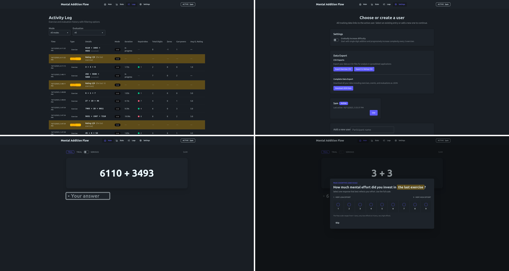

# Mental Addition Flow Test App

*context: Experiments with the Muse 2 EEG*

Mental Addition Flow is a browser-based practice app for rapid-fire addition exercises paired with lightweight cognitive load tracking. It is built with Vue 3 and Vite and keeps all learning data on-device using Dexie, making it easy to explore performance trends without a backend.

## Features
- **Focused practice loop** – delivers random single- through four-digit addition problems with immediate regeneration once the correct answer is entered.
- **User-centric tracking** – exercises, keystrokes, focus changes, and effort ratings are linked to the active user so multiple people can share the same device.
- **Serious vs trial modes** – toggle modes mid-session, including a countdown for serious runs, while automatically logging every transition.
- **Cognitive load prompts** – occasionally asks Paas’ 9-point effort rating across varied scopes (last task, last three, etc.).
- **Analytics dashboard** – the Stats view visualizes correlations, a difficulty predictor with weight optimization, and cognitive load trends.
- **Data export** – export exercises with predicted difficulty, ratings, and events as CSV or JSON for external analysis.

## Tech Stack
- Vue 3 with `<script setup>` and TypeScript
- Vite dev/build tooling
- Vue Router for view navigation
- Tailwind CSS + DaisyUI for styling
- Dexie (IndexedDB) for offline-first storage
- Chart.js + vue-chartjs for analytics visuals
- Lucide icons

## Local Development
Requirements: Node.js ≥ 18 and npm.

```bash
# Install dependencies
npm install

# Start the dev server
npm run dev
```

### Quality Checks
- `npm run lint` – run ESLint across TypeScript and Vue files.
- `npm run build` – type-check with `vue-tsc` and produce a production build.

### Data Storage
All data is stored locally in IndexedDB via Dexie. Clearing the browser storage or switching browsers will remove existing exercises and logs.

## Project Structure
```
src/
  components/            # Shared UI components (charts, difficulty predictor, etc.)
  composables/           # Reusable logic (difficulty calc, Dexie helpers)
  db/                    # Dexie schema + data access helpers
  views/                 # Main, Stats, Settings, and Logs views
  utils/                 # Exercise generation and supporting utilities
```

## License
MIT © Mental Addition Flow contributors
